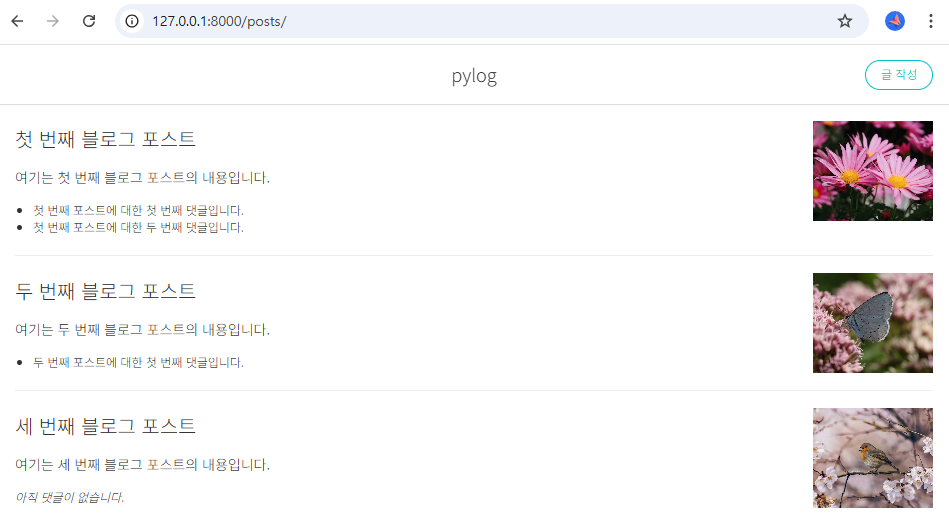
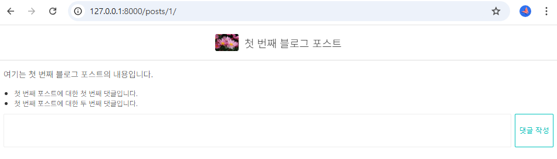
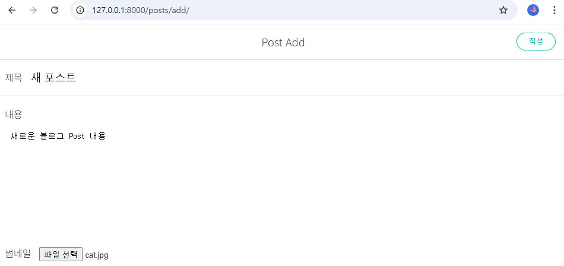

# Pylog 프로젝트
이 프로젝트는 이한영의 장고 입문에 실린 Pylog 프로젝트를 기반으로 한 클론 코딩 프로젝트입니다.   
Django 프레임워크를 활용하여 다양한 기능을 구현했습니다. 앞선 PyBurger 프로젝트에서 학습한 내용을 발전시키고, 블로그에 필요한 기본 기능을 구현하는 데 중점을 두었습니다.   

## 기간
2024.10.27 ~ 2024.10.29

## 주요 기능
1. **블로그 게시글 및 댓글 관리**   
어드민 페이지에서 글과 댓글 데이터를 제어할 수 있도록 추가했으며, 글과 댓글 리스트를 조회하는 페이지와 각 게시글에 대한 상세 페이지를 구현했습니다.

2. **사용자 입력 및 이미지 업로드**   
블로그에서 사용자가 직접 글과 댓글을 작성해 데이터베이스에 저장하고, 이미지 파일을 업로드하는 기능을 추가했습니다.

3. **Docker 기반 개발 환경 구성**   
Docker와 Docker Compose로 환경을 설정해 컨테이너에서 일관되게 실행할 수 있도록 구성했습니다.

## 기술 스택
    - 백엔드: Django
    - 프론트엔드: HTML, CSS, Django 템플릿
    - 데이터베이스: Django ORM (SQLite3)
    - 컨테이너: Docker

## 설정 및 실행
1. **저장소 클론**
    ```bash
    git clone https://github.com/rlozl15/pylog.git
    cd pylog
    ```
2. **Docker 환경 준비**
   - Docker Desktop을 실행합니다.

3. **Docker 이미지 빌드 및 실행**
    ```bash
    docker-compose up -d --build
    ```
4. **Django 앱 마이그레이션**
    ```bash
    docker-compose exec django-app python manage.py migrate
    ```
5. **블로그 데이터 임의 추가**
    ```bash
    docker-compose exec django-app python manage.py loaddata blogData.json
    ```
6. **Django 서버 확인**
   - http://localhost:8000에서 Django 애플리케이션에 접근할 수 있습니다.
7. **관리자 계정 생성**
    - 필요시 admin 페이지 확인을 위해 superuser를 생성해야 합니다.
    ```
    docker-compose exec django-service python manage.py createsuperuser
    ```  
  
 

